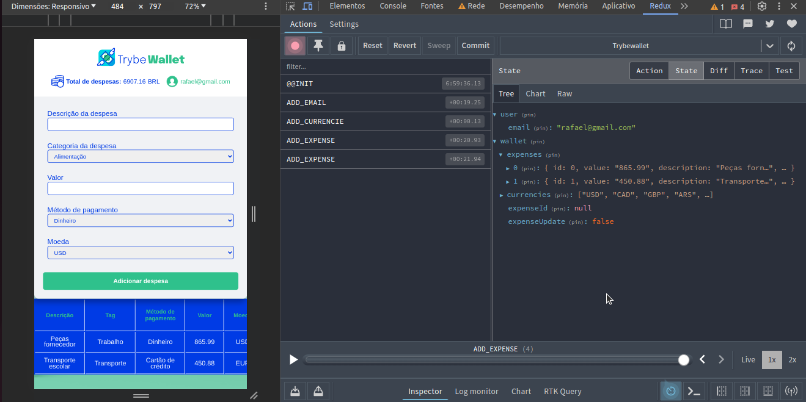

# Controle de Gastos com Conversor de Moedas

## Visão Geral

Este projeto é uma carteira de controle de gastos com um conversor de moedas. A aplicação permite aos usuários gerenciar seus gastos, incluindo adicionar, remover e editar despesas. Além disso, ela fornece a funcionalidade de visualizar uma tabela de gastos e o total de gastos convertidos para uma moeda de escolha do usuário.

O projeto demonstra a capacidade de criar um _store_ Redux em aplicações React, criar _reducers_, _actions_ e _dispatchers_ no Redux, usar hooks do Redux para manipulação e leitura do estado global e criar _actions_ assíncronas na aplicação React que fazem uso do Redux.

## Capturas de Tela

## Tela Login

## Tela Inicial

## Tela Inicial Funcionamento

# Habilidades Demonstradas

## Neste projeto, as seguintes habilidades foram demonstradas:

- Criação de um store Redux em aplicações React.
- Criação de reducers no Redux em aplicações React.
- Criação de actions no Redux em aplicações React.
- Criação de dispatchers no Redux em aplicações React.
- Uso dos hooks do Redux para manipulação e leitura do estado global.
- Criação de actions assíncronas na aplicação React que fazem uso do Redux.

# Author

Rafael Magalhães Guedes

# Licença

Livre